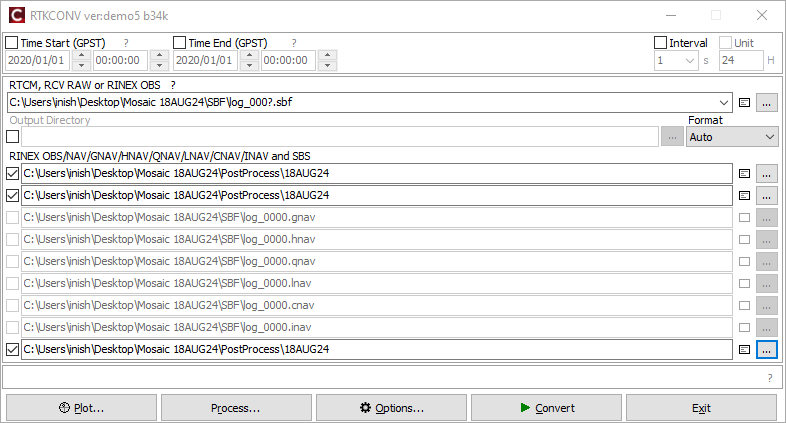

# Mosaic X5

I am using six functions on the Mosaic X5 with Ethernet shield.

1. It can act like a CORS Station and a recipe exists on the following pages for setup.

<figure><figcaption></figcaption></figure>

2. It shows jamming attempts and has a simple spectrum analyzer.

<figure><figcaption></figcaption></figure>

3. When using OSNMA signed functionality, it can detect spoofing attempts, Galileo only.&#x20;

<figure><figcaption></figcaption></figure>

4. It has an NTP clock, (5) a PtP clock and (6) 1PPS.

<figure><figcaption></figcaption></figure>
