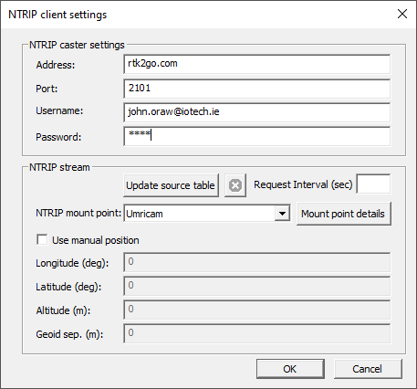

# Survey In

Do this work immediately after install and before doing anything else! Your CORS needs to know exactly where its antenna is.

All post-processing has been carried out using [RTKLIB: demo5 b34k](https://github.com/rtklibexplorer/RTKLIB/releases). Earlier versions did not seem to understand the Septentrio binary format?

Create a top level directory with the date to keep your workflow. Mine is **Mosaic 18AUG24**.

## Logging

In RxControl, go to Logging->RxControl Logging. I set the location under Global and logged for 24 hours.

<figure><figcaption></figcaption></figure>

## Rover RINEX data

In Base/Rover terms, this is the Rover data.&#x20;

1. Run the **RTKLaunch** tool.
2. Run the **RTKCONV** tool.

* As an input file, select your 24-hour log file. My first file was called log\_0000.sbf with a number of files, the file number incrementing sequentially. Because there are many files, I can use the **?** symbol as a wildcard.
* The tool will suggest file names for **OBS**, **NAV** and **SBS** files. Save these file in a directory called **Rover RINEX**.
* Click Convert and go for coffee.

## Base RINEX data

Next I need to find an official source of RINEX data to the official datum. In the UK and Ireland, this data can be got from OS/OSI. For my location, I can get data from two stations, Malin and Foyle, at [https://gnss.osi.ie/download-rinex.php](https://gnss.osi.ie/download-rinex.php) I select the station, date, start and end time. The data downloads as a ZIP file and when I extract the files, I have three files per hour.&#x20;

Save these in a folder, mine are called **Malin RINEX** and **Foyle RINEX.** Note that the data is not available until c. 2 hours after it is logged, and sometimes stations are broken, no data!

## Conversion

Now I can convert my data.&#x20;

Create a directory called **PostProcess** and run the **RTKCONV** tool.

I use the proprietary SBF log files, which this version of RTKLIB understands.

* Click Convert and go for dinner!

<figure><figcaption></figcaption></figure>

## Post Process

Now I can post-process my data.&#x20;

Run the **RTKPOST** tool.

<figure><figcaption></figcaption></figure>

* The rover RINEX OBS data is the .obs file from the **Rover RINEX** directory.
* The base station RINEX OBS data is the .XXo file from the **Foyle RINEX** directory. Because there are many files, I can use the **?** symbol as a wildcard.
* The base station RINEX NAV data is the .XXn file from the **Foyle RINEX** directory. Because there are many files, I can use the **?** symbol as a wildcard.
* Click Convert and go for dinner!

I copy the output to a directory called **Solution**. There are three files, I load the one with the **.pos** extension into Excel as a space delimited text file. There is a header, and then I get columns of data. Any row with a **Q** value of **1** is in RTK Fixed mode and should be accurate. I ignore rows with any other Q value using Excel's filter function.

<figure><figcaption></figcaption></figure>

I do a sanity check by 2D plotting each row. I did this work near solar maximum on 18th August 2024. My readings were way off during the early hours, corresponding with Aurora and diurnal variation in the earth's magnetic field, etc. Whenever doing this work, try to avoid periods when the sun is cracking with M and X class flares and some of the best aurora in 20 years is visible. Its also a wake up call to the vulnerability of satellite navigation. I filtered out the big variations.

I can now do calculations, see how stable the position is, get the mean values, variance etc. I had measurements taken in 2021 and I can compare them.

<figure><figcaption></figcaption></figure>

That variation is very high, I will repeat this when the sun is less active.

When all of this is finished, you have a CORS, but only on your home network. See elsewhere in these notes for relaying this to RTK2GO or your own NTRIP server.
