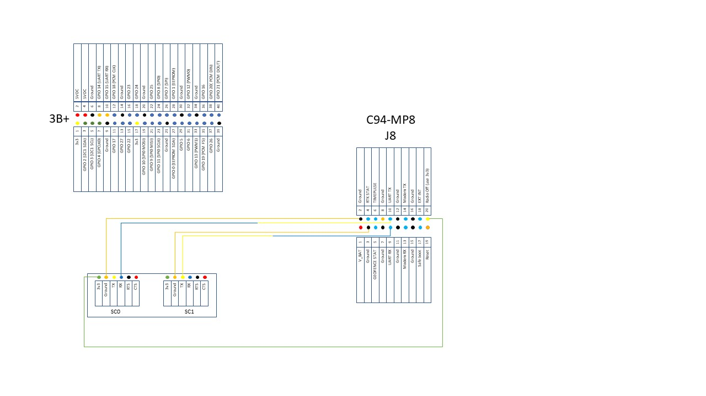

# 4G CORS

The first RTK kit I worked with was based on the M8P chip, with a built in modem. In a pair, they gave a good short range solution. Mount the base on the roof of the pickup truck and then survey-in for 10 minutes. The absolute position was +/- 1.5m, but the relative position was in centimeters for the rover.

The next iteration was to properly locate the antenna using an external RTK source. This was possible using the laptop U-Center connection. This gives good absolute position accuracy (I still need to gather data on these!).

There is a way to disable the modem and use the MP8 as an L1 only RTK system. The wiring diagram below disables the modem. I am using a I2C piggyback board for 2 extra serial connections @ 38400.

<figure><figcaption></figcaption></figure>

There is only one UART on the MP8, I am not using I2C or SPI. RX is set to receive an RTCM stream from a CORS station, using str2str from SC1. TX sends a NMEA string to the Pi for logging and /or forwarding, to SC0.

All tested 29JAN22.

<figure><figcaption></figcaption></figure>
