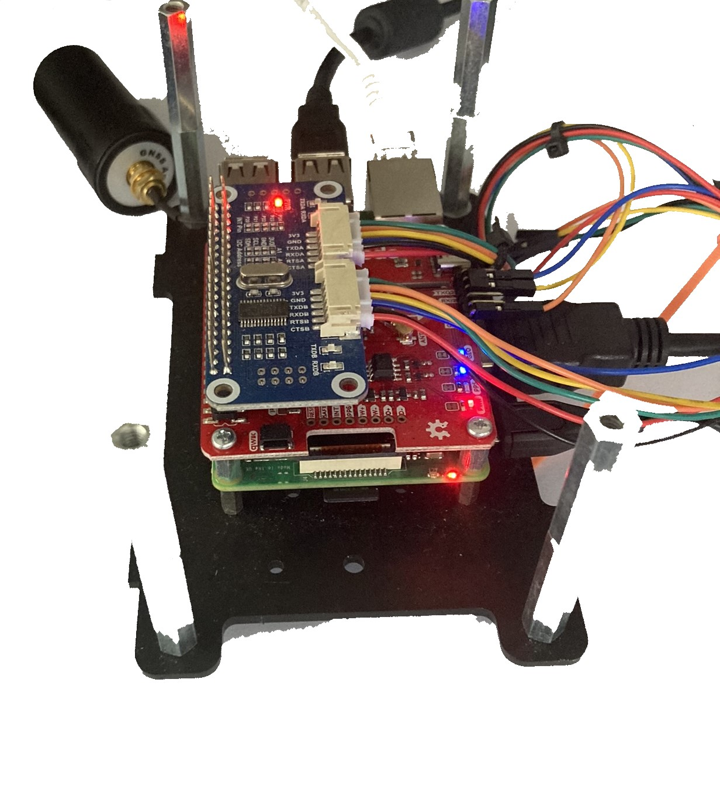

# UBlox ZED 9R

This project uses a Sparkfun Ublox ZED-9R for navigation with heading. The most simple design is one which uses an add-on UART board for RTK and uses ttyS0 for data. It is intended for use with either rtklib\str2str or with the accompanying RTCM3 client.

ProjectRLogger is the first version, this logs data only.

<figure><figcaption></figcaption></figure>

1.
